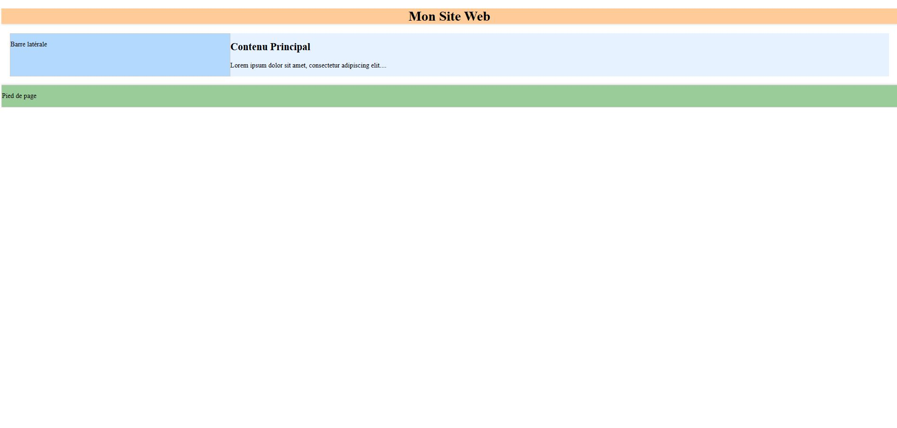

# Instructions

Appliquez des styles CSS sur le fichier HTML :

1. Définir une **couleur** d'arrière-plan différente pour chaque élément: 
    - `header` : `#FFCC99`, 
    - `main` : `#E6F2FF`, 
    - `aside` `#B3D9FF`:, 
    - `footer` : `#99CC99` ) ;
2. Mettre en **gras** et **centrer** le texte du titre dans l'en-tête ;
3. Ajouter une **marge** de 20 pixels autour de la section principale ;
4. Utiliser **Flexbox** pour disposer la barre latérale à gauche et le contenu principal à droite (`aside : flex 1` et `section : flex 3`) ;
5. Ajouter une **bordure** de 1 pixel autour de la barre latérale et du pied de page, avec une couleur de bordure grise (#CCC);
6. Ajouter une **ombre** à l'en-tête et au pied de page pour les faire ressortir.

> Si vous avez des difficultés, vous pouvez vous référer à la partie 3 du cours [Créez votre site web avec HTML5 et CSS3](https://openclassrooms.com/fr/courses/1603881-creez-votre-site-web-avec-html5-et-css3/8061352-structurez-votre-page).

## Résultat

Voici le rendu de la page web :

