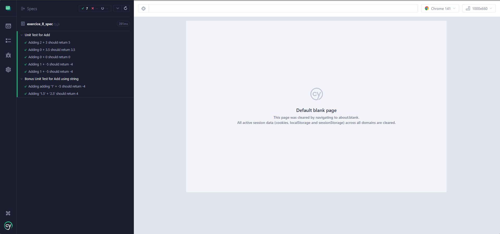

# Instructions

Créez une **fonction JavaScript `add`** qui prend *deux nombres* (`int` ou `float`) en entrée et retourne leur **somme** (`int` ou `float`).

> Si vous avez des difficultés, vous pouvez vous référer à la partie 2 du cours [Apprenez à programmer avec JavaScript](https://openclassrooms.com/fr/courses/7696886-apprenez-a-programmer-avec-javascript/8205116-apprehendez-la-logique-de-programmation).

## Résultat

Voici le rendu de la page web :

